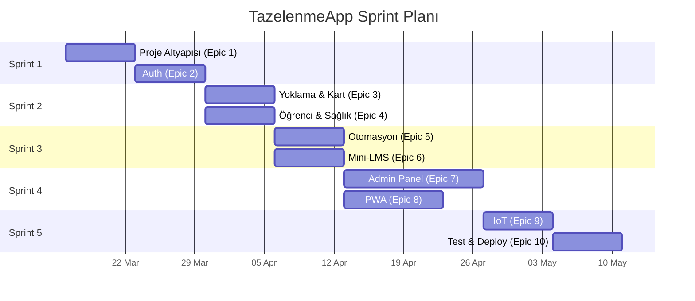

# TazelenmeApp — Detaylı Kanban Board

> **Öncelik Kodları**: 🔴 Kritik (Blocker) · 🟠 Yüksek · 🟡 Orta · 🟢 Düşük
> **Efor**: SP (Story Point) — 1 SP ≈ 4 saat

---

## Sprint 1 — Temel Altyapı & Auth (2 hafta)

### Epic 1: Proje Altyapısı (Foundation)

| # | Görev | Öncelik | SP | Durum | Bağımlılık |
|---|-------|---------|----|----|------------|
| 1.1 | Git repo oluştur, `.gitignore`, `README.md` | 🔴 | 1 | ✅ Done | — |
| 1.2 | `docker-compose.yml` yaz (frontend, backend, postgres containers) | 🔴 | 3 | ✅ Done | — |
| 1.3 | Next.js projesi başlat (`next-pwa`, Tailwind CSS, shadcn/ui kurulumu) | 🔴 | 3 | ✅ Done | 1.1 |
| 1.4 | Node.js + Express (TypeScript) backend projesi başlat | 🔴 | 2 | ✅ Done | 1.1 |
| 1.5 | PostgreSQL container + Prisma ORM bağlantısı | 🔴 | 2 | ✅ Done | 1.2, 1.4 |
| 1.6 | Prisma şeması yaz (`schema.prisma` — tüm modeller) | 🔴 | 3 | ✅ Done | 1.5 |
| 1.7 | **[YENİ]** `Classroom` modeli ekle (id, name, code — e.g. `"AMFI_1"`) | 🟠 | 1 | ✅ Done | 1.6 |
| 1.8 | **[YENİ]** `Notification` modeli ekle (type, message, isRead, actionTaken) | 🟠 | 1 | ✅ Done | 1.6 |
| 1.9 | **[YENİ]** `AuditLog` modeli ekle (userId, action, entity, details, timestamp) | 🟡 | 1 | ✅ Done | 1.6 |
| 1.10 | **[YENİ]** `LessonSession`'a `startTime`, `endTime`, `classroomId` alanları ekle | 🔴 | 1 | ✅ Done | 1.7 |
| 1.11 | Seed data script'i (10 öğrenci, 3 ders, demo yoklama) | 🟡 | 2 | ✅ Done | 1.6 |
| 1.12 | Merkezi hata yönetimi middleware'i (Error Handler) | 🟠 | 2 | ✅ Done | 1.4 |
| 1.13 | Structured logging kurulumu (Pino / Winston) | 🟡 | 1 | ✅ Done | 1.4 |

---

### Epic 2: Kimlik Doğrulama & Yetkilendirme (Auth)

| # | Görev | Öncelik | SP | Durum | Bağımlılık |
|---|-------|---------|----|----|------------|
| 2.1 | `POST /api/v1/auth/login` — TC + PIN ile giriş, JWT döndür | 🔴 | 3 | ✅ Done | 1.6 |
| 2.2 | PIN hash'leme (argon2) ve doğrulama utility fonksiyonları | 🔴 | 2 | ✅ Done | 1.4 |
| 2.3 | JWT token oluşturma, doğrulama ve refresh token mekanizması | 🔴 | 3 | ✅ Done | 1.4 |
| 2.4 | Auth middleware (role-based: `ADMIN`, `STUDENT`) | 🔴 | 2 | ✅ Done | 2.3 |
| 2.5 | `POST /api/v1/auth/logout` — Token invalidation | 🟠 | 1 | ✅ Done | 2.3 |
| 2.6 | **[YENİ]** IoT cihaz kimlik doğrulama (API Key / Bearer Token) | 🟠 | 2 | ✅ Done | 2.4 |
| 2.7 | **[YENİ]** Rate limiting middleware (express-rate-limit) | 🟠 | 1 | ✅ Done | 1.4 |
| 2.8 | **[YENİ]** CORS politikası (Frontend + IoT origins) | 🟠 | 1 | ✅ Done | 1.4 |

---

## Sprint 2 — Core Business Logic (2 hafta)

### Epic 3: Hızlı Yoklama & Kart Yönetimi (Core)

| # | Görev | Öncelik | SP | Durum | Bağımlılık |
|---|-------|---------|----|----|------------|
| 3.1 | `POST /api/v1/attendance/scan` — RFID kart okutma endpoint'i | 🔴 | 5 | 📋 Backlog | 2.6, 1.10 |
| 3.2 | Anti-Passback kontrolü (`@@unique` seviyesinde + uygulama katmanı) | 🔴 | 2 | 📋 Backlog | 3.1 |
| 3.3 | `findActiveSessionForLocation()` — Saat + sınıf bazlı otomatik ders eşleme | 🔴 | 3 | 📋 Backlog | 1.10, 3.1 |
| 3.4 | `POST /api/v1/cards` — Kart atama (Koordinatör) | 🔴 | 2 | 📋 Backlog | 2.4 |
| 3.5 | `PATCH /api/v1/cards/:id/status` — Kart iptal/pasif yapma | 🔴 | 2 | 📋 Backlog | 3.4 |
| 3.6 | Kayıp/iptal kart okutulduğunda 403 + uyarı kaydı oluşturma | 🟠 | 2 | 📋 Backlog | 3.1, 1.8 |
| 3.7 | `POST /api/v1/attendance/manual` — Manuel yoklama (Geldi/Gelmedi/İzinli) | 🟠 | 2 | 📋 Backlog | 2.4 |
| 3.8 | `GET /api/v1/attendance/session/:id` — Ders seansı yoklama listesi | 🟠 | 2 | 📋 Backlog | 2.4 |

---

### Epic 4: Öğrenci & Sağlık Verisi Yönetimi

| # | Görev | Öncelik | SP | Durum | Bağımlılık |
|---|-------|---------|----|----|------------|
| 4.1 | `POST /api/v1/students` — Öğrenci oluşturma (demografik + sağlık) | 🔴 | 3 | 📋 Backlog | 2.4 |
| 4.2 | `GET /api/v1/students` — Öğrenci listesi (filtreleme, pagination) | 🟠 | 2 | 📋 Backlog | 2.4 |
| 4.3 | `GET /api/v1/students/:id` — Öğrenci detay (profil + sağlık + kart + yoklama) | 🟠 | 2 | 📋 Backlog | 2.4 |
| 4.4 | `PUT /api/v1/students/:id` — Öğrenci güncelleme | 🟠 | 2 | 📋 Backlog | 2.4 |
| 4.5 | `DELETE /api/v1/students/:id` — Öğrenci silme (soft delete) | 🟡 | 1 | 📋 Backlog | 2.4 |
| 4.6 | **[YENİ]** `POST /api/v1/students/import` — Excel/CSV toplu import | 🟡 | 3 | 📋 Backlog | 4.1 |
| 4.7 | **[YENİ]** TC Kimlik No veritabanı seviyesinde AES şifreleme (KVKK) | 🟠 | 3 | 📋 Backlog | 1.6 |

---

## Sprint 3 — Otomasyon, Mini-LMS & Dashboard API (2 hafta)

### Epic 5: Otomasyon & İzolasyon Alarmları

| # | Görev | Öncelik | SP | Durum | Bağımlılık |
|---|-------|---------|----|----|------------|
| 5.1 | Cron job: 3 haftalık devamsızlık tarama (node-cron, her Cuma 18:00) | 🔴 | 3 | 📋 Backlog | 3.1, 1.6 |
| 5.2 | `isAtRisk` flag güncelleme + `Notification` kaydı oluşturma | 🔴 | 2 | 📋 Backlog | 5.1, 1.8 |
| 5.3 | `GET /api/v1/notifications` — Koordinatör bildirim listesi | 🟠 | 2 | 📋 Backlog | 1.8, 2.4 |
| 5.4 | `PATCH /api/v1/notifications/:id` — Bildirim okundu/aksiyon alındı | 🟡 | 1 | 📋 Backlog | 5.3 |
| 5.5 | Dönem sonu Geçti/Kaldı otomatik hesaplama (%70 katılım kuralı) | 🟠 | 3 | 📋 Backlog | 3.1 |
| 5.6 | `GET /api/v1/reports/pass-fail?courseId=&term=` — Geçti/Kaldı raporu | 🟠 | 2 | 📋 Backlog | 5.5, 2.4 |

---

### Epic 6: Ders & Materyal Yönetimi (Mini-LMS)

| # | Görev | Öncelik | SP | Durum | Bağımlılık |
|---|-------|---------|----|----|------------|
| 6.1 | `CRUD /api/v1/courses` — Ders oluşturma, güncelleme, silme | 🔴 | 3 | 📋 Backlog | 2.4 |
| 6.2 | `POST /api/v1/enrollments` — Öğrenci-ders kaydı | 🔴 | 2 | 📋 Backlog | 6.1, 4.1 |
| 6.3 | `CRUD /api/v1/sessions` — Ders oturumu (hafta/saat) yönetimi | 🟠 | 2 | 📋 Backlog | 6.1, 1.10 |
| 6.4 | `POST /api/v1/materials` — PDF/Link yükleme (multer ile dosya upload) | 🟠 | 3 | 📋 Backlog | 6.1, 2.4 |
| 6.5 | `GET /api/v1/materials?courseId=` — Materyal listeleme | 🟠 | 1 | 📋 Backlog | 6.4 |
| 6.6 | `GET /api/v1/student/my-courses` — Öğrencinin kayıtlı dersleri + materyalleri | 🟠 | 2 | 📋 Backlog | 6.2, 2.4 |
| 6.7 | **[YENİ]** Dosya depolama stratejisi (local disk → Docker volume) | 🟡 | 2 | 📋 Backlog | 1.2 |

---

## Sprint 4 — Frontend (Admin Panel & PWA) (3 hafta)

### Epic 7: Koordinatör Dashboard (Admin Panel)

| # | Görev | Öncelik | SP | Durum | Bağımlılık |
|---|-------|---------|----|----|------------|
| 7.1 | Admin layout (Sidebar + Header + Content area — shadcn/ui) | 🔴 | 3 | 📋 Backlog | 1.3 |
| 7.2 | Dashboard Ana Ekran: Günlük istatistikler, yoklama oranları, alarm kutusu | 🔴 | 5 | 📋 Backlog | 7.1, 5.3 |
| 7.3 | Öğrenci Yönetimi sayfası: DataTable (filtreleme, arama, sıralama) | 🔴 | 5 | 📋 Backlog | 7.1, 4.2 |
| 7.4 | Öğrenci Detay sayfası: Profil, Sağlık, Kartlar, Yoklama geçmişi | 🟠 | 4 | 📋 Backlog | 7.3, 4.3 |
| 7.5 | Öğrenci Ekleme/Düzenleme formu (sağlık checkbox'ları dahil) | 🟠 | 3 | 📋 Backlog | 7.3, 4.1 |
| 7.6 | Yoklama Yönetimi: Aktif ders listesi, canlı yoklama ekranı | 🔴 | 5 | 📋 Backlog | 7.1, 3.8 |
| 7.7 | Manuel yoklama: Öğrenci listesinde tek tıkla Geldi/Gelmedi/İzinli | 🟠 | 3 | 📋 Backlog | 7.6, 3.7 |
| 7.8 | Ders & Materyal Yönetimi sayfası | 🟠 | 3 | 📋 Backlog | 7.1, 6.1 |
| 7.9 | Excel/CSV export (öğrenci listesi, yoklama raporu, geçti/kaldı) | 🟡 | 3 | 📋 Backlog | 7.3, 5.6 |
| 7.10 | **[YENİ]** Real-time yoklama güncellemeleri (WebSocket / SSE) | 🟡 | 4 | 📋 Backlog | 7.6, 3.1 |
| 7.11 | Kart yönetimi: Atama, iptal, geçmiş kartlar | 🟠 | 3 | 📋 Backlog | 7.4, 3.4 |
| 7.12 | **[YENİ]** Dashboard grafikleri (Recharts: haftalık trend, ders bazlı katılım) | 🟡 | 3 | 📋 Backlog | 7.2 |
| 7.13 | **[YENİ]** Excel/CSV toplu öğrenci import UI | 🟡 | 2 | 📋 Backlog | 7.3, 4.6 |

---

### Epic 8: Öğrenci PWA (60+ Yaş Arayüzü)

| # | Görev | Öncelik | SP | Durum | Bağımlılık |
|---|-------|---------|----|----|------------|
| 8.1 | PWA kurulumu (`next-pwa`, manifest, service worker, icons) | 🔴 | 3 | 📋 Backlog | 1.3 |
| 8.2 | Giriş ekranı: Büyük numpad ile TC + PIN girişi | 🔴 | 3 | 📋 Backlog | 8.1, 2.1 |
| 8.3 | Ana ekran: 2-3 devasa buton (Derslerim, Ders Notlarım) | 🔴 | 2 | 📋 Backlog | 8.1 |
| 8.4 | "Derslerim ve Devamsızlığım" sayfası: Ders listesi + yoklama durumu | 🟠 | 3 | 📋 Backlog | 8.3, 6.6 |
| 8.5 | "Ders Notlarım" sayfası: Materyal indirme/görüntüleme | 🟠 | 2 | 📋 Backlog | 8.3, 6.6 |
| 8.6 | Erişilebilirlik (A11Y): min 18px font, yüksek kontrast, focus yönetimi | 🔴 | 3 | 📋 Backlog | 8.2, 8.3, 8.4, 8.5 |
| 8.7 | **[YENİ]** PWA offline desteği (materyaller cache'leme) | 🟢 | 3 | 📋 Backlog | 8.5 |

---

## Sprint 5 — IoT, Test & Dağıtım (2 hafta)

### Epic 9: IoT / Donanım Entegrasyonu

| # | Görev | Öncelik | SP | Durum | Bağımlılık |
|---|-------|---------|----|----|------------|
| 9.1 | ESP8266 firmware: Wi-Fi bağlantısı + RC522 kart okuma | 🟠 | 3 | 📋 Backlog | — |
| 9.2 | HTTP POST isteği atma (cardUid + deviceLocation JSON) | 🟠 | 2 | 📋 Backlog | 9.1, 3.1 |
| 9.3 | LED geri bildirim: Yeşil (başarılı) / Kırmızı (hata) | 🟡 | 1 | 📋 Backlog | 9.2 |
| 9.4 | Buzzer geri bildirim: Bip (OK) / Uzun bip (hata) | 🟡 | 1 | 📋 Backlog | 9.2 |
| 9.5 | **[YENİ]** API Key'i cihaz firmware'ine güvenli şekilde gömme | 🟠 | 1 | 📋 Backlog | 2.6, 9.1 |
| 9.6 | **[YENİ]** Bağlantı kopması durumu: Offline buffer + retry mekanizması | 🟢 | 3 | 📋 Backlog | 9.2 |

---

### Epic 10: Test & Dağıtım (QA + DevOps)

| # | Görev | Öncelik | SP | Durum | Bağımlılık |
|---|-------|---------|----|----|------------|
| 10.1 | Backend unit testleri (Jest — Auth, Attendance, Card servisleri) | 🟠 | 5 | 📋 Backlog | Epic 2, 3 |
| 10.2 | Backend integration testleri (Supertest — API endpoint'leri) | 🟠 | 4 | 📋 Backlog | 10.1 |
| 10.3 | Frontend component testleri (Vitest — shadcn/ui bileşenleri) | 🟡 | 3 | 📋 Backlog | Epic 7, 8 |
| 10.4 | E2E testleri (Playwright/Cypress — kritik akışlar) | 🟡 | 5 | 📋 Backlog | 10.1, 10.3 |
| 10.5 | Docker production build doğrulama (`docker-compose up` ile tam test) | 🔴 | 2 | 📋 Backlog | Tüm Epics |
| 10.6 | Load testing: 200 eşzamanlı kart okutma simulasyonu (k6 / Artillery) | 🟠 | 3 | 📋 Backlog | 3.1, 10.5 |
| 10.7 | API dökümantasyonu (Swagger / OpenAPI) | 🟡 | 3 | 📋 Backlog | Tüm API'ler |
| 10.8 | Kullanıcı kılavuzu (Koordinatör + Öğrenci) | 🟢 | 2 | 📋 Backlog | Epic 7, 8 |

---

## Özet Dashboard

---

## Toplam Efor Özeti

| Epic | Toplam SP | Sprint |
|------|-----------|--------|
| 1 — Proje Altyapısı | ~23 SP | Sprint 1 |
| 2 — Auth | ~15 SP | Sprint 1 |
| 3 — Yoklama & Kart | ~20 SP | Sprint 2 |
| 4 — Öğrenci & Sağlık | ~16 SP | Sprint 2 |
| 5 — Otomasyon | ~13 SP | Sprint 3 |
| 6 — Mini-LMS | ~15 SP | Sprint 3 |
| 7 — Admin Panel | ~43 SP | Sprint 4 |
| 8 — PWA | ~19 SP | Sprint 4 |
| 9 — IoT | ~11 SP | Sprint 5 |
| 10 — Test & Deploy | ~27 SP | Sprint 5 |
| **Toplam** | **~202 SP** | **~11 hafta** |

> [!TIP]
> `[YENİ]` etiketli görevler orijinal gereksinimlerde olmayıp benim önerimle eklenen görevlerdir. Bunları önceliklendirirken ihtiyacınıza göre kapsam dışı (out of scope) bırakabilirsiniz.

---

## 📝 Tamamlanan Görevler Logu

### 2026-03-11 — Epic 1: Proje Altyapısı ✅

| # | Görev | Tamamlanma |
|---|-------|------------|
| 1.1 | Git repo, `.gitignore`, `README.md` | ✅ 02:19 |
| 1.4 | Express + TypeScript backend projesi | ✅ 02:22 |
| 1.12 | Merkezi hata yönetimi (`AppError` + `errorHandler`) | ✅ 02:24 |
| 1.13 | Pino structured logging | ✅ 02:24 |
| 1.5 | Prisma ORM bağlantısı + `prisma.config.ts` | ✅ 02:27 |
| 1.6 | Prisma şeması — 11 model, 7 enum | ✅ 02:30 |
| 1.7 | `Classroom` modeli | ✅ 02:30 |
| 1.8 | `Notification` modeli | ✅ 02:30 |
| 1.9 | `AuditLog` modeli | ✅ 02:30 |
| 1.10 | `LessonSession` — startTime, endTime, classroomId | ✅ 02:30 |
| 1.11 | Seed data (10 öğrenci, 3 ders, RFID kartlar, yoklama) | ✅ 02:32 |
| 1.2 | `docker-compose.yml` + Dockerfile'lar | ✅ 02:33 |
| 1.3 | Next.js + Tailwind CSS + shadcn/ui | ✅ 02:38 |

> **Not:** Prisma v7'de `datasource` bloğunda `url` alanı kaldırıldı — `prisma.config.ts` yapısına uyarlandı.

### 2026-03-11 — Epic 2: Auth ✅

| # | Görev | Tamamlanma |
|---|-------|------------|
| 2.2 | PIN hash (argon2id) — `pin.ts` | ✅ 02:55 |
| 2.3 | JWT token (access + refresh) — `jwt.ts` | ✅ 02:55 |
| 2.4 | Auth middleware (authenticate, authorize) — `auth.ts` | ✅ 02:56 |
| 2.6 | IoT cihaz auth (API Key) — `auth.ts` | ✅ 02:56 |
| 2.7 | Rate limiting (general/auth/IoT) — `rateLimiter.ts` | ✅ 02:57 |
| 2.1 | Login endpoint — `auth.controller.ts` + `auth.routes.ts` | ✅ 02:58 |
| 2.5 | Logout endpoint + Audit log | ✅ 02:58 |
| 2.8 | CORS güncelleme (`x-api-key` header) — `server.ts` | ✅ 02:59 |

> **Demo Giriş Bilgileri:** Admin TC: `11111111111` PIN: `1234` · Öğrenci TC: `22222222221` PIN: `4921`

