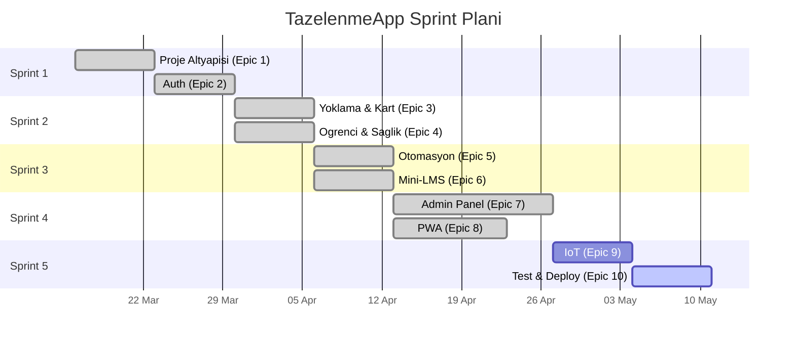

# TazelenmeApp - Detailed Kanban Board

> **Oncelik Kodlari**: Kritk · Yuksek · Orta · Dusuk
> **Efor**: SP (Story Point) - 1 SP ~= 4 saat

---

## Sprint 1 - Temel Altyapi & Auth

### Epic 1: Proje Altyapisi

| # | Gorev | Oncelik | SP | Durum | Bagimlilik |
|---|-------|---------|----|-------|------------|
| 1.1 | Git repo, `.gitignore`, `README.md` | Kritik | 1 | Done | - |
| 1.2 | `docker-compose.yml` (frontend, backend, postgres) | Kritik | 3 | Done | - |
| 1.3 | Next.js, Tailwind CSS, shadcn/ui kurulumu | Kritik | 3 | Done | 1.1 |
| 1.4 | Node.js + Express (TypeScript) backend | Kritik | 2 | Done | 1.1 |
| 1.5 | PostgreSQL + Prisma baglantisi | Kritik | 2 | Done | 1.2, 1.4 |
| 1.6 | `schema.prisma` tum modeller | Kritik | 3 | Done | 1.5 |
| 1.7 | `[YENI]` `Classroom` modeli | Yuksek | 1 | Done | 1.6 |
| 1.8 | `[YENI]` `Notification` modeli | Yuksek | 1 | Done | 1.6 |
| 1.9 | `[YENI]` `AuditLog` modeli | Orta | 1 | Done | 1.6 |
| 1.10 | `LessonSession` alanlari: `startTime`, `endTime`, `classroomId` | Kritik | 1 | Done | 1.7 |
| 1.11 | Seed data script'i | Orta | 2 | Done | 1.6 |
| 1.12 | Merkezi hata yonetimi middleware'i | Yuksek | 2 | Done | 1.4 |
| 1.13 | Structured logging | Orta | 1 | Done | 1.4 |

### Epic 2: Kimlik Dogrulama & Yetkilendirme

| # | Gorev | Oncelik | SP | Durum | Bagimlilik |
|---|-------|---------|----|-------|------------|
| 2.1 | `POST /api/v1/auth/login` | Kritik | 3 | Done | 1.6 |
| 2.2 | PIN hashleme ve dogrulama | Kritik | 2 | Done | 1.4 |
| 2.3 | JWT access + refresh token | Kritik | 3 | Done | 1.4 |
| 2.4 | Auth middleware (`ADMIN`, `STUDENT`) | Kritik | 2 | Done | 2.3 |
| 2.5 | `POST /api/v1/auth/logout` | Yuksek | 1 | Done | 2.3 |
| 2.6 | `[YENI]` IoT cihaz auth (API Key) | Yuksek | 2 | Done | 2.4 |
| 2.7 | `[YENI]` Rate limiting | Yuksek | 1 | Done | 1.4 |
| 2.8 | `[YENI]` CORS politikasi | Yuksek | 1 | Done | 1.4 |

---

## Sprint 2 - Core Business Logic

### Epic 3: Hizli Yoklama & Kart Yonetimi

| # | Gorev | Oncelik | SP | Durum | Bagimlilik |
|---|-------|---------|----|-------|------------|
| 3.1 | `POST /api/v1/attendance/scan` | Kritik | 5 | Done | 2.6, 1.10 |
| 3.2 | Anti-passback kontrolu | Kritik | 2 | Done | 3.1 |
| 3.3 | `findActiveSessionForLocation()` | Kritik | 3 | Done | 1.10, 3.1 |
| 3.4 | `POST /api/v1/cards` | Kritik | 2 | Done | 2.4 |
| 3.5 | `PATCH /api/v1/cards/:id/status` | Kritik | 2 | Done | 3.4 |
| 3.6 | Kayip/iptal kart icin 403 + bildirim | Yuksek | 2 | Done | 3.1, 1.8 |
| 3.7 | `POST /api/v1/attendance/manual` | Yuksek | 2 | Done | 2.4 |
| 3.8 | `GET /api/v1/attendance/session/:id` | Yuksek | 2 | Done | 2.4 |

### Epic 4: Ogrenci & Saglik Verisi Yonetimi

| # | Gorev | Oncelik | SP | Durum | Bagimlilik |
|---|-------|---------|----|-------|------------|
| 4.1 | `POST /api/v1/students` | Kritik | 3 | Done | 2.4 |
| 4.2 | `GET /api/v1/students` | Yuksek | 2 | Done | 2.4 |
| 4.3 | `GET /api/v1/students/:id` | Yuksek | 2 | Done | 2.4 |
| 4.4 | `PUT /api/v1/students/:id` | Yuksek | 2 | Done | 2.4 |
| 4.5 | `DELETE /api/v1/students/:id` | Orta | 1 | Done | 2.4 |
| 4.6 | `[YENI]` `POST /api/v1/students/import` | Orta | 3 | Done | 4.1 |
| 4.7 | `[YENI]` AES sifreleme (`tcNoEncrypted`, `tcNoHash`) | Yuksek | 3 | Done | 1.6 |

---

## Sprint 3 - Otomasyon, Mini-LMS & Dashboard API

### Epic 5: Otomasyon & Izolasyon Alarmlari

| # | Gorev | Oncelik | SP | Durum | Bagimlilik |
|---|-------|---------|----|-------|------------|
| 5.1 | Haftalik devamsizlik cron job | Kritik | 3 | Done | 3.1, 1.6 |
| 5.2 | `isAtRisk` guncelleme + `Notification` olusturma | Kritik | 2 | Done | 5.1, 1.8 |
| 5.3 | `GET /api/v1/notifications` | Yuksek | 2 | Done | 1.8, 2.4 |
| 5.4 | `PATCH /api/v1/notifications/:id` | Orta | 1 | Done | 5.3 |
| 5.5 | `%70` kurali ile gecti/kaldi hesaplama | Yuksek | 3 | Done | 3.1 |
| 5.6 | `GET /api/v1/reports/pass-fail` | Yuksek | 2 | Done | 5.5, 2.4 |

### Epic 6: Ders & Materyal Yonetimi

| # | Gorev | Oncelik | SP | Durum | Bagimlilik |
|---|-------|---------|----|-------|------------|
| 6.0 | `[YENI]` `CRUD /api/v1/classrooms` | Yuksek | 2 | Done | 1.7, 2.4 |
| 6.1 | `CRUD /api/v1/courses` | Kritik | 3 | Done | 2.4 |
| 6.2 | `POST /api/v1/enrollments` | Kritik | 2 | Done | 6.1, 4.1 |
| 6.3 | `CRUD /api/v1/sessions` | Yuksek | 2 | Done | 6.1, 1.10 |
| 6.4 | `POST /api/v1/materials` | Yuksek | 3 | Done | 6.1, 2.4 |
| 6.5 | `GET /api/v1/materials?courseId=` | Yuksek | 1 | Done | 6.4 |
| 6.6 | `GET /api/v1/student/my-courses` | Yuksek | 2 | Done | 6.2, 2.4 |
| 6.7 | `[YENI]` Local disk -> Docker volume depolama | Orta | 2 | Done | 1.2 |

### Sprint 3 Hardening

| # | Gorev | Oncelik | SP | Durum | Bagimlilik |
|---|-------|---------|----|-------|------------|
| H.1 | Docker rebuild + migration deploy dogrulama | Yuksek | 1 | Done | 5.x, 6.x |
| H.2 | Smoke test: auth, attendance, reports, notifications | Yuksek | 2 | Done | H.1 |
| H.3 | Manuel yoklama icin enrollment guard | Kritik | 1 | Done | 3.7 |

---

## Sprint 4 - Frontend (Admin Panel & PWA)

> Guncel not: Sprint 4 tamamen tamamlandi. `Epic 7 - Admin Panel` ve `Epic 8 - Ogrenci PWA` (8.1-8.6) Done. 8.7 Offline cache sonraki sprinte birakildi. Unified login (admin + ogrenci tek ekrandan role-based redirect) eklendi. Gecici test deploymentu Render + Vercel uzerinde aktif.

### Epic 7: Koordinator Dashboard

| # | Gorev | Oncelik | SP | Durum | Bagimlilik |
|---|-------|---------|----|-------|------------|
| 7.1 | Admin layout | Kritik | 3 | Done | 1.3 |
| 7.2 | Dashboard ana ekran | Kritik | 5 | Done | 7.1, 5.3 |
| 7.3 | Ogrenci yonetimi DataTable | Kritik | 5 | Done | 7.1, 4.2 |
| 7.4 | Ogrenci detay sayfasi | Yuksek | 4 | Done | 7.3, 4.3 |
| 7.5 | Ogrenci ekleme/duzenleme formu | Yuksek | 3 | Done | 7.3, 4.1 |
| 7.6 | Yoklama yonetimi ekranlari | Kritik | 5 | Done | 7.1, 3.8 |
| 7.7 | Manuel yoklama UI | Yuksek | 3 | Done | 7.6, 3.7 |
| 7.8 | Ders & materyal yonetimi sayfasi | Yuksek | 3 | Done | 7.1, 6.1 |
| 7.9 | Excel/CSV export | Orta | 3 | Done | 7.3, 5.6 |
| 7.10 | `[YENI]` Realtime yoklama (WebSocket / SSE) | Orta | 4 | Done | 7.6, 3.1 |
| 7.11 | Kart yonetimi | Yuksek | 3 | Done | 7.4, 3.4 |
| 7.12 | `[YENI]` Dashboard grafikleri | Orta | 3 | Done | 7.2 |
| 7.13 | `[YENI]` Ogrenci import UI | Orta | 2 | Done | 7.3, 4.6 |

### Epic 8: Ogrenci PWA

| # | Gorev | Oncelik | SP | Durum | Bagimlilik |
|---|-------|---------|----|-------|------------|
| 8.1 | PWA kurulumu | Kritik | 3 | Done | 1.3 |
| 8.2 | Buyuk numpad ile giris ekrani | Kritik | 3 | Done | 8.1, 2.1 |
| 8.3 | Ana ekran: buyuk butonlar | Kritik | 2 | Done | 8.1 |
| 8.4 | Derslerim ve devamsizligim sayfasi | Yuksek | 3 | Done | 8.3, 6.6 |
| 8.5 | Ders notlarim / materyal sayfasi | Yuksek | 2 | Done | 8.3, 6.6 |
| 8.6 | A11Y: font, kontrast, focus | Kritik | 3 | Done | 8.2, 8.3, 8.4, 8.5 |
| 8.7 | `[YENI]` Offline materyal cache | Dusuk | 3 | Deferred | 8.5 |

---

## Sprint 5 - IoT, Test & Dagitim

### Epic 9: IoT / Donanim Entegrasyonu

| # | Gorev | Oncelik | SP | Durum | Bagimlilik |
|---|-------|---------|----|-------|------------|
| 9.1 | ESP8266 firmware + RC522 | Yuksek | 3 | Backlog | - |
| 9.2 | HTTP POST ile cardUid + deviceLocation | Yuksek | 2 | Backlog | 9.1, 3.1 |
| 9.3 | LED geri bildirim | Orta | 1 | Backlog | 9.2 |
| 9.4 | Buzzer geri bildirim | Orta | 1 | Backlog | 9.2 |
| 9.5 | `[YENI]` API Key'i firmware'e guvenli gom | Yuksek | 1 | Backlog | 2.6, 9.1 |
| 9.6 | `[YENI]` Offline buffer + retry | Dusuk | 3 | Backlog | 9.2 |

### Epic 10: Test & Dagitim

| # | Gorev | Oncelik | SP | Durum | Bagimlilik |
|---|-------|---------|----|-------|------------|
| 10.1 | Backend unit testleri | Yuksek | 5 | Backlog | Epic 2, 3 |
| 10.2 | Backend integration testleri | Yuksek | 4 | Backlog | 10.1 |
| 10.3 | Frontend component testleri | Orta | 3 | Backlog | Epic 7, 8 |
| 10.4 | E2E testleri | Orta | 5 | Backlog | 10.1, 10.3 |
| 10.5 | Docker production build dogrulama | Kritik | 2 | In Progress | Tum epics |
| 10.6 | Load testing | Yuksek | 3 | Backlog | 3.1, 10.5 |
| 10.7 | API dokumantasyonu | Orta | 3 | Backlog | Tum API'ler |
| 10.8 | Kullanici kilavuzu | Dusuk | 2 | Backlog | Epic 7, 8 |

---

## Ozet Dashboard

---

## Toplam Efor Ozeti

| Epic | Toplam SP | Sprint |
|------|-----------|--------|
| 1 - Proje Altyapisi | ~23 SP | Sprint 1 Done |
| 2 - Auth | ~15 SP | Sprint 1 Done |
| 3 - Yoklama & Kart | ~20 SP | Sprint 2 Done |
| 4 - Ogrenci & Saglik | ~16 SP | Sprint 2 Done |
| 5 - Otomasyon | ~13 SP | Sprint 3 Done |
| 6 - Mini-LMS | ~17 SP | Sprint 3 Done |
| 7 - Admin Panel | ~43 SP | Sprint 4 Done |
| 8 - PWA | ~16 SP | Sprint 4 Done (8.7 Deferred) |
| 9 - IoT | ~11 SP | Sprint 5 |
| 10 - Test & Deploy | ~27 SP | Sprint 5 |
| **Toplam** | **~204 SP** | **~11 hafta** |

> `[YENI]` etiketli gorevler orijinal gereksinimlerden sonra eklenen iyilestirmelerdir.

---

## Tamamlanan Gorevler Logu

### 2026-03-11 - Epic 1: Proje Altyapisi

| # | Gorev | Tamamlanma |
|---|-------|------------|
| 1.1 | Git repo, `.gitignore`, `README.md` | 02:19 |
| 1.4 | Express + TypeScript backend | 02:22 |
| 1.12 | Error handler | 02:24 |
| 1.13 | Pino logging | 02:24 |
| 1.5 | Prisma baglantisi + `prisma.config.ts` | 02:27 |
| 1.6 | Prisma schema | 02:30 |
| 1.7 | `Classroom` modeli | 02:30 |
| 1.8 | `Notification` modeli | 02:30 |
| 1.9 | `AuditLog` modeli | 02:30 |
| 1.10 | `LessonSession` alanlari | 02:30 |
| 1.11 | Seed data | 02:32 |
| 1.2 | `docker-compose.yml` + Dockerfile'lar | 02:33 |
| 1.3 | Next.js + Tailwind + shadcn/ui | 02:38 |

### 2026-03-11 - Epic 2: Auth

| # | Gorev | Tamamlanma |
|---|-------|------------|
| 2.2 | PIN hash | 02:55 |
| 2.3 | JWT access + refresh | 02:55 |
| 2.4 | Auth middleware | 02:56 |
| 2.6 | IoT API key auth | 02:56 |
| 2.7 | Rate limiting | 02:57 |
| 2.1 | Login endpoint | 02:58 |
| 2.5 | Logout + audit log | 02:58 |
| 2.8 | CORS guncelleme | 02:59 |

### 2026-03-17 - Epic 3: Yoklama & Kart Yonetimi

| # | Gorev | Tamamlanma |
|---|-------|------------|
| 3.1 | RFID kart okutma | 04:15 |
| 3.2 | Anti-passback | 04:15 |
| 3.3 | `findActiveSessionForLocation()` | 04:15 |
| 3.4 | Kart atama | 04:18 |
| 3.5 | Kart durumu guncelleme | 04:18 |
| 3.6 | Kayip kart bildirimi | 04:15 |
| 3.7 | Manuel yoklama | 04:15 |
| 3.8 | Seans yoklama listesi | 04:15 |

### 2026-03-17 - Epic 4: Ogrenci & Saglik Verisi

| # | Gorev | Tamamlanma |
|---|-------|------------|
| 4.1 | Ogrenci olusturma | 04:20 |
| 4.2 | Ogrenci listesi | 04:20 |
| 4.3 | Ogrenci detay | 04:20 |
| 4.4 | Ogrenci guncelleme | 04:20 |
| 4.5 | Ogrenci soft delete | 04:20 |
| 4.6 | CSV import | 04:22 |
| 4.7 | AES-256-GCM sifreleme utility | 04:22 |

### 2026-04-08 - Epic 5: Otomasyon & Izolasyon

| # | Gorev | Tamamlanma |
|---|-------|------------|
| 5.1 | Haftalik izolasyon cron job | 00:41 |
| 5.2 | `isAtRisk` + Notification guncelleme | 00:41 |
| 5.3 | Bildirim listeleme | 00:41 |
| 5.4 | Bildirim guncelleme | 00:41 |
| 5.5 | `%70` gecme/kalma kurali | 00:41 |
| 5.6 | `GET /api/v1/reports/pass-fail` | 00:41 |

### 2026-04-08 - Epic 6: Ders & Materyal

| # | Gorev | Tamamlanma |
|---|-------|------------|
| 6.0 | `CRUD /api/v1/classrooms` | 01:05 |
| 6.1 | Ders CRUD | 00:41 |
| 6.2 | Enrollment endpoint'leri | 00:41 |
| 6.3 | Session CRUD + toplu uretim | 00:41 |
| 6.4 | Materyal upload | 00:41 |
| 6.5 | Materyal listeleme/detail/download | 00:41 |
| 6.6 | Student portal endpoint'leri | 00:41 |
| 6.7 | Docker volume upload depolama | 00:41 |

### 2026-04-08 - Sprint 3 Smoke Test & Hardening

| # | Gorev | Tamamlanma |
|---|-------|------------|
| T1 | Migration deploy dogrulama | 00:44 |
| T2 | Auth, attendance, reports, notifications smoke test | 00:59 |
| T3 | Manuel yoklama icin enrollment guard | 01:05 |
| T4 | Classroom API ile bootstrap eksiginin giderilmesi | 01:05 |

### 2026-04-22 - Epic 8: Ogrenci PWA + Unified Login

| # | Gorev | Tamamlanma |
|---|-------|------------|
| U.1 | Unified login: admin + ogrenci tek ekrandan role-based redirect | 14:14 |
| U.2 | Middleware: /student/* koruma + cross-role redirect | 14:14 |
| 8.1 | PWA manifest + meta tags + app icon | 14:54 |
| 8.3 | Student ana ekran: buyuk butonlar + istatistikler | 15:00 |
| 8.4 | Derslerim & devamsizligim sayfasi (progress bar, risk badge) | 15:00 |
| 8.5 | Materyal sayfasi (ders filtresi, PDF/Video/Link kartlari) | 14:53 |
| 8.6 | A11Y: 18px font, 48px touch target, focus ring, kontrast | 15:00 |
| 8.2 | Student shell: mobile-first layout + premium bottom nav | 15:30 |
| R.1 | Premium UI redesign: gradient header, stat kartlari, animasyonlar | 18:08 |

### 2026-04-22 - Deployment (Gecici Test)

| # | Gorev | Tamamlanma |
|---|-------|------------|
| D.1 | Backend: Render Web Service (Docker) deploy | 21:52 |
| D.2 | Database: Render PostgreSQL kurulumu + migration | 21:52 |
| D.3 | Frontend: Vercel deploy (Next.js) | 22:32 |
| D.4 | SSL fix, CORS coklu origin, seed idempotency guclendirilmesi | 21:59 |
